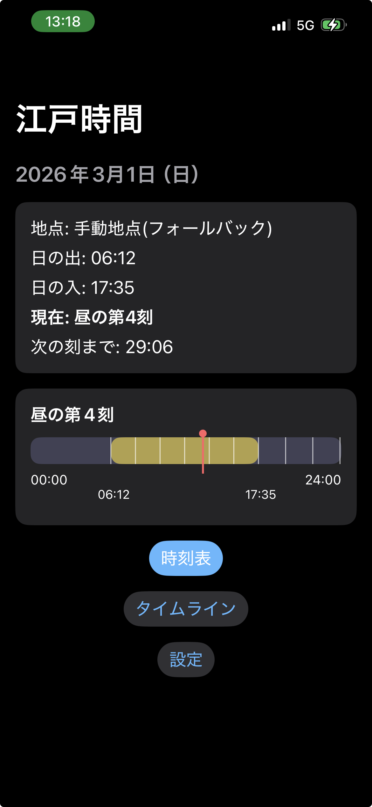

# EdoTime（江戸時間）

現代の時刻を、江戸時代の「不定時法（昼夜をそれぞれ6等分）」で表示する iOS アプリです。  
日の出・日の入りを基準に、現在が「昼の第◯刻 / 夜の第◯刻」のどこに当たるかを可視化します。

## 概要

- 現在地（または手動地点）の日の出・日の入りを計算
- 昼夜をそれぞれ6分割した「江戸時間」を算出
- 今がどの刻か／次の刻までの残り時間を表示
- タイムラインで1日の流れを視覚的に確認可能

## 主な機能

- 🌅 日の出・日の入りの自動計算（NOAAベース・オフライン）
- 🕰 現在の刻（例：昼の第4刻）をリアルタイム表示
- ⏳ 次の刻までの残り時間をカウントダウン表示
- 📊 昼夜の配分をタイムラインで可視化
- 📍 位置情報取得（失敗時は手動地点にフォールバック）

## Screenshots

## 技術スタック

- Swift / SwiftUI
- MVVMアーキテクチャ
- CoreLocation
- 独自 SolarCalculator（NOAA Solar Calculator 準拠）
- GitHub + Git

## 設計メモ

- `SolarCalculator` は UTC → ローカル時刻変換時の日付跨ぎ問題を考慮
- View は状態表示に専念し、計算ロジックは ViewModel / Service に分離
- 「動く状態を小さく積み上げていく」方針で実装

## 今後の改善アイデア

- 地点履歴の保存
- Widget対応
- 年間の昼夜変化を可視化
- 多言語対応（日本語 / 英語）

## ライセンス

Private repository（個人開発）

※ 個人学習・実験目的のiOSアプリです。
